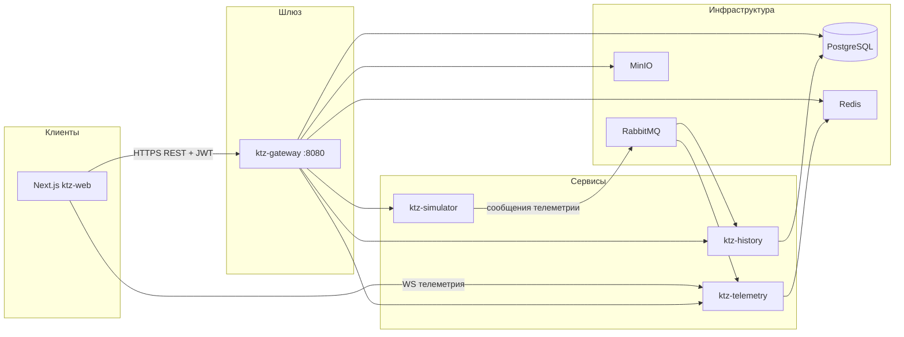

# Kinetic Observer (KTZ)

Монорепозиторий системы мониторинга локомотивов: телеметрия в реальном времени, карта парка, диспетчеризация, история, веб-кабина машиниста и отчёты. Бэкенд — микросервисы на **Java 17 / Spring Boot 3**, фронтенд — **Next.js 15** (`ktz-web`). Трафик снаружи обычно идёт через **API-шлюз** (`ktz-gateway`).

---

## Содержание

1. [Архитектура](#архитектура)
2. [Модули репозитория](#модули-репозитория)
3. [Технологии](#технологии)
4. [Требования](#требования)
5. [Быстрый старт (Docker Compose)](#быстрый-старт-docker-compose)
6. [Локальная разработка без Docker (сервисы по отдельности)](#локальная-разработка-без-docker)
7. [Переменные окружения](#переменные-окружения)
8. [Шлюз: маршруты, Swagger, Actuator](#шлюз-маршруты-swagger-actuator)
9. [Аутентификация и роли](#аутентификация-и-роли)
10. [Веб-приложение `ktz-web`](#веб-приложение-ktz-web)
11. [WebSocket и телеметрия](#websocket-и-телеметрия)
12. [База данных и миграции](#база-данных-и-миграции)
13. [Сборка и тесты](#сборка-и-тесты)
14. [Порты по умолчанию](#порты-по-умолчанию)
15. [Устранение неполадок](#устранение-неполадок)

---

## Архитектура

На высоком уровне поток данных выглядит так:



- **Симулятор** публикует поток телеметрии (частота задаётся `TELEMETRY_FREQUENCY_HZ` и конфигом локомотивов).
- **Телеметрия** потребляет сообщения, держит состояние в Redis, отдаёт **WebSocket** клиентам по номеру локомотива.
- **История** сохраняет/отдаёт исторические данные (PostgreSQL, RabbitMQ).
- **Шлюз** — единая точка для REST (маршруты, локомотивы, пользователи, auth), прокси к сервисам с префиксами `/simulator`, `/telemetry`, `/history`, JWT, Flyway для схемы БД шлюза, MinIO для файлов (например, фото профиля).

---

## Модули репозитория

| Каталог | Назначение |
|--------|------------|
| **`ktz-gateway`** | Spring Cloud Gateway, Security (JWT), CORS, маршрутизация к simulator/telemetry/history, собственные REST (auth, user, route, locomotive), R2DBC + Flyway (PostgreSQL), Redis, MinIO. |
| **`ktz-simulator`** | Генерация телеметрии, публикация в RabbitMQ, REST под префиксом `/simulator`. |
| **`ktz-telemetry`** | Потребление RabbitMQ, Redis, WebSocket эндпоинты для телеметрии и здоровья по локомотиву, REST под `/telemetry`. |
| **`ktz-history`** | JPA, PostgreSQL, история/экспорт, RabbitMQ, REST (в т.ч. под `/history`). |
| **`ktz-web`** | SPA на Next.js App Router: кабина, карта, маршрут, обслуживание, replay/история буфера, админка диспетчера, отчёты, профиль, чат/SOS (WS). |

Корневой **`pom.xml`** — агрегатор Maven-модулей (`ktz-full`).

---

## Технологии

- **Backend:** Java 17, Spring Boot 3.2.x, Spring Cloud Gateway 2023.0.x, Spring Security, WebFlux (шлюз), R2DBC PostgreSQL, Flyway, Redis (reactive), JWT, Lombok, Springdoc OpenAPI, Actuator.
- **Frontend:** Next.js 15, React 19, TypeScript, Tailwind CSS, Leaflet (карта), Recharts, jsPDF (экспорт PDF), STOMP/SockJS (чат).
- **Инфраструктура (compose):** RabbitMQ 3.13 (management UI на `15672`), PostgreSQL 15, Redis 7, MinIO.

---

## Требования

- **JDK 17** (для сборки и запуска Java-модулей).
- **Maven 3.8+**.
- **Docker + Docker Compose** (рекомендуемый способ поднять зависимости и сервисы).
- **Node.js 20+** и **npm** — для `ktz-web`.

---

## Быстрый старт (Docker Compose)

1. Склонируйте репозиторий и перейдите в корень.

2. Создайте файл **`.env`** в корне (шаблон — **`.env.example`**):

   ```bash
   cp .env.example .env
   ```

   В продакшене обязательно смените **`JWT_SECRET`**, пароли БД, MinIO и т.д.

3. Соберите и поднимите стек:

   ```bash
   docker compose build
   docker compose up -d
   ```

4. Дождитесь готовности **postgres**, **rabbitmq**, **redis** (healthchecks в `docker-compose.yml`).

5. **Шлюз** слушает **`GATEWAY_PORT`** (по умолчанию **8080**). Проверка:

   ```text
   GET http://localhost:8080/actuator/health
   ```

6. **Фронтенд** в Docker в этом compose **не** поднимается — его запускают отдельно (см. ниже).

### Запуск веб-интерфейса

```bash
cd ktz-web
cp .env.example .env.local
# Убедитесь, что URL указывают на доступный с хоста шлюз и телеметрию
npm install
npm run dev
```

По умолчанию Next.js: **http://localhost:3000**. В `.env.local` для локальной машины обычно:

```env
NEXT_PUBLIC_API_URL=http://localhost:8080
NEXT_PUBLIC_TELEMETRY_WS_URL=ws://localhost:8082
```

`NEXT_PUBLIC_*` встраиваются в клиентский бандл на этапе **`next build`** — после смены переменных пересоберите фронт.

---

## Локальная разработка без Docker

1. Поднимите только инфраструктуру (или используйте уже установленные PostgreSQL, RabbitMQ, Redis, MinIO) и пропишите хосты/порты в переменных окружения или в `application.yml` каждого сервиса.

2. Соберите все модули из корня:

   ```bash
   mvn -q -DskipTests package
   ```

3. Запускайте Spring Boot приложения в удобном порядке (сначала инфраструктура, затем simulator → telemetry → history → gateway) с выставленными **`SERVER_PORT`**, **`SPRING_*`**, **`JWT_*`**, **`SIMULATOR_HOST`** / **`TELEMETRY_HOST`** / **`HISTORY_HOST`** для шлюза (при локальном запуске часто `localhost`).

---

## Переменные окружения

### Корень проекта (`.env` для Docker Compose)

См. **`.env.example`**: порты сервисов, RabbitMQ, PostgreSQL, Redis, MinIO, JWT, параметры симулятора (номера и типы локомотивов, координаты маршрутов), частота телеметрии.

Важно:

- **`JWT_SECRET`** — криптостойкая строка в проде.
- **`POSTGRES_URL`** / **`R2DBC_URL`** / **`FLYWAY_URL`** — для контейнеров используются имена сервисов Docker (`postgres`, и т.д.).

### `ktz-web` (`ktz-web/.env.local`)

| Переменная | Описание |
|------------|----------|
| **`NEXT_PUBLIC_API_URL`** | Базовый URL шлюза (REST, auth). Пример: `http://localhost:8080`. |
| **`NEXT_PUBLIC_TELEMETRY_WS_URL`** | Базовый URL WebSocket **без** path (к нему дописываются `/ws/telemetry/{loco}` и т.д.). Пример: `ws://localhost:8082` при прямом доступе к telemetry; при проксировании через шлюз нужен фактический WS endpoint, доступный из браузера. |

---

## Шлюз: маршруты, Swagger, Actuator

- **Единая точка входа** для браузера по REST: обычно `NEXT_PUBLIC_API_URL` = хост:порт **gateway**.
- Прокси к сервисам (см. `ktz-gateway/src/main/resources/application.yml`):
  - **`/simulator/**`** → ktz-simulator  
  - **`/telemetry/**`** → ktz-telemetry  
  - **`/history/**`** → ktz-history  

- **OpenAPI / Swagger UI** шлюза и агрегированные спеки сервисов настроены в `application.yml` и `springdoc` (пути вида `/v3/api-docs`, `/simulator/v3/api-docs`, …). Публичные пути для документации перечислены в **`SecurityConfig`**.

- **Actuator** (без JWT, см. `SecurityConfig`):
  - **`/actuator/**`** — actuator самого шлюза;
  - **`/simulator/actuator/**`**, **`/telemetry/actuator/**`**, **`/history/actuator/**`** — проксируются на соответствующие сервисы с **`StripPrefix=1`** (запрос `/simulator/actuator/health` доходит до сервиса как `/actuator/health`).

Проверка здоровья шлюза:

```http
GET /actuator/health
```

---

## Аутентификация и роли

- Регистрация и вход реализованы на шлюзе (`/auth/**` — публично в конфиге безопасности).
- После входа клиент сохраняет сессию (JWT + refresh) в **`localStorage`** и выставляет cookie **`ktz_auth`** для middleware Next.js.
- Роли в JWT (например **`ROLE_USER`** — машинист, **`ROLE_ADMIN`** — диспетчер) ограничивают доступ к API (создание маршрутов, CRUD пользователей и т.д. — см. `SecurityConfig` в gateway).
- В **`ktz-web`** middleware защищает все страницы кроме **`/login`**: без cookie `ktz_auth` выполняется редирект на логин.

---

## Веб-приложение `ktz-web`

- **Стек:** Next.js 15 (App Router), React 19, TypeScript, Tailwind.
- **Основные разделы:** кабина (`/`), карта (`/map`), история буфера / replay (`/replay`), маршрут, обслуживание, отчёты, профиль, админка (`/admin`) для диспетчера, логин.
- **API:** модуль **`src/shared/lib/api-client.ts`** — базовый URL из `NEXT_PUBLIC_API_URL`, заголовок `Authorization: Bearer` из сессии, при 401 — refresh через `/auth/refresh`.
- **Телеметрия в UI:** контекст **`TelemetryProvider`** — буфер последних 15 минут для экспорта CSV/PDF, подключение WS к телеметрии и здоровью по номеру локомотива (`localStorage` `ktz_loco_number`, см. **`setKtzLocoNumber`**).
- **Чат / SOS:** WebSocket через **`connectBidirectionalWs`** (базовый URL из `NEXT_PUBLIC_TELEMETRY_WS_URL`).

Скрипты `package.json`:

```bash
npm run dev    # разработка (Turbopack)
npm run build  # production-сборка
npm run start  # после build
npm run lint
```

---

## WebSocket и телеметрия

- Клиент подключается к **`NEXT_PUBLIC_TELEMETRY_WS_URL`** и путям вида **`/ws/telemetry/{locomotiveNumber}`**, **`/ws/health/{locomotiveNumber}`** (реализация на стороне `ktz-telemetry`).
- При работе через один хост с прокси WS нужно убедиться, что браузер может установить WebSocket на выбранный хост/порт (CORS/прокси для WS).

---

## База данных и миграции

- **PostgreSQL** используется шлюзом (R2DBC + Flyway) и сервисом **history** (JPA).
- SQL-миграции шлюза: **`ktz-gateway/src/main/resources/db/migration/`** (`V1__...`, `V2__...`, …).
- Параметры подключения задаются переменными окружения в compose или локально.

---

## Сборка и тесты

Сборка всех Java-модулей:

```bash
mvn clean package
```

Пропуск тестов:

```bash
mvn -DskipTests package
```

Docker-образы собираются из **`Dockerfile`** в каждом модуле; контекст сборки в `docker-compose.yml` — **корень репозитория** (`.`), чтобы подключать общие зависимости при необходимости.

---

## Порты по умолчанию

| Сервис | Переменная / порт по умолчанию |
|--------|--------------------------------|
| Gateway | `GATEWAY_PORT` → **8080** |
| Simulator | `SIMULATOR_PORT` → **8081** |
| Telemetry | `TELEMETRY_PORT` → **8082** |
| History | `HISTORY_PORT` → **8083** |
| PostgreSQL | **5432** |
| RabbitMQ AMQP | **5672** |
| RabbitMQ Management UI | **15672** |
| Redis | `REDIS_PORT` → **6379** |
| MinIO API / Console | **9000** / **9001** |
| Next.js dev | **3000** |

---

## Устранение неполадок

1. **401 на API после логина**  
   Проверьте, что запросы идут на **`NEXT_PUBLIC_API_URL`** шлюза, в `localStorage` есть валидный токен, время на машине корректное (JWT expiry).

2. **WebSocket не подключается**  
   Убедитесь, что **`NEXT_PUBLIC_TELEMETRY_WS_URL`** доступен из браузера (не `localhost` сервера, если открываете сайт с другого устройства). Проверьте файрвол и то, что **`ktz-telemetry`** запущен и слушает ожидаемый порт.

3. **Пустая телеметрия / буфер**  
   Должны работать симулятор и очередь; для выбранного локомотива должен совпадать номер в **`ktz_loco_number`** и поток WS.

4. **Docker: сервис падает при старте**  
   Смотрите логи: `docker compose logs -f <service>`. Частая причина — не готовы **postgres** / **rabbitmq** / **redis** (дождитесь healthcheck).

5. **CORS**  
   Настраивается на шлюзе (`CorsConfigurationSource`). При нестандартном origin фронта может потребоваться правка конфигурации.

---

## Лицензия и контакты

Проект **ktz-full** / Kinetic Observer — внутренняя разработка; уточните лицензию и ответственных в вашей организации.

---

*Документ сгенерирован по состоянию репозитория; при изменении портов, путей API или compose сверяйте актуальные **`application.yml`**, **`SecurityConfig`**, **`docker-compose.yml`**, **`middleware.ts`** и **`.env.example`***.
