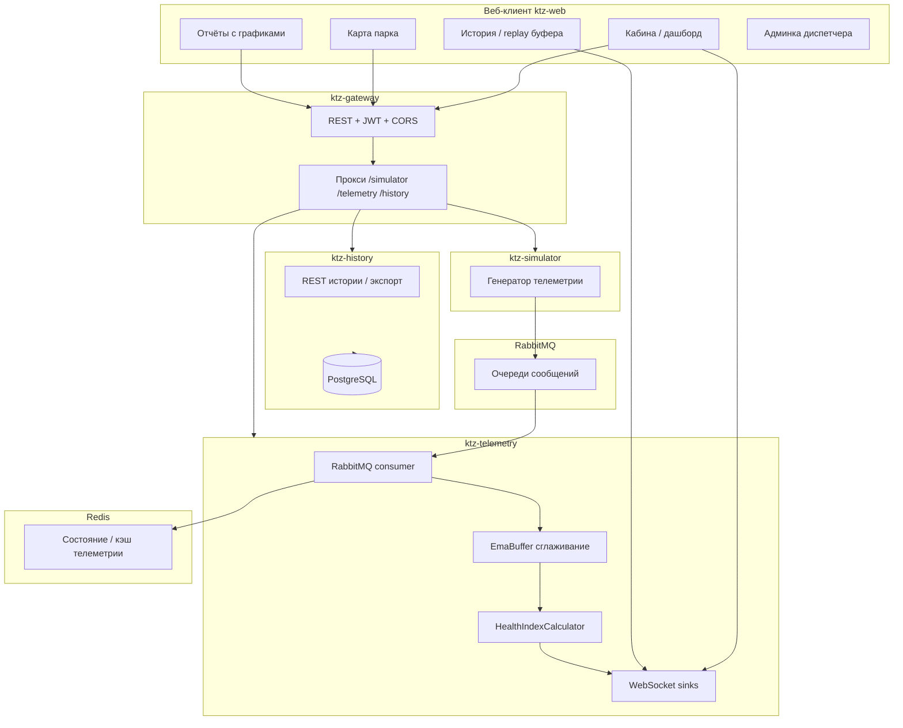

# Архитектура проекта Kinetic Observer (KTZ)

Документ описывает **сквозную архитектуру** решения и соответствие требованиям демо/конкурса: веб-приложение, симулятор и поток телеметрии, дашборды с живыми графиками, индекс здоровья с прозрачной логикой, алерты и рекомендации, replay недавней истории, готовность к показу жюри.

---

## 1. Обзор: соответствие требованиям

| Требование | Реализация в проекте | Ключевые артефакты |
|------------|----------------------|---------------------|
| **Рабочее веб-приложение** | SPA на Next.js 15: кабина, карта, маршрут, обслуживание, история/replay, отчёты, админка, профиль, логин | `ktz-web/` |
| **Симулятор / стриминг телеметрии** | Публикация телеметрии в RabbitMQ; потребление и WebSocket-стрим на клиент | `ktz-simulator/`, `ktz-telemetry/`, `ktz-gateway/` (прокси) |
| **Дашборд с живыми графиками** | Панели с Recharts (тренды в кабине, отчёты, профиль маршрута) | `ktz-web/src/widgets/trends-panel.tsx`, `reports/page.tsx`, `route/page.tsx` |
| **Индекс здоровья + прозрачная формула** | Серверный расчёт штрафов по факторам, веса, итоговый score 0–100, факторы и вклад в ответе API/WS | `ktz-telemetry/.../health/HealthIndexCalculator.java` |
| **Алерты / рекомендации** | Рекомендации из health; отображение в UI; при CRIT — рассылка по WS `alert/*` | `TelemetryConsumer.java`, `telemetry-context.tsx`, `alerts-panel.tsx` |
| **Replay недавней истории** | Буфер ~15 мин снимков на клиенте + страница replay; экспорт CSV/PDF | `telemetry-context.tsx`, `replay/page.tsx`, `export-utils.ts` |
| **Готовность к демо** | Docker Compose, единый шлюз, Swagger, actuator, README | `docker-compose.yml`, `ktz-gateway/`, `README.md` |

---

## 2. Логическая архитектура



---

## 3. Компоненты по слоям

### 3.1. Веб-приложение (`ktz-web`)

| Область | Назначение |
|---------|------------|
| **App Router** (`src/app/`) | Маршруты: `/`, `/map`, `/replay`, `/route`, `/maintenance`, `/reports`, `/admin`, `/profile`, `/login` |
| **TelemetryProvider** | Контекст React: текущая телеметрия, WebSocket `/ws/telemetry/{loco}`, `/ws/health/{loco}`, буфер снимков 15 мин |
| **Виджеты** | `fleet-map`, `health-indicator-detailed`, `trends-panel`, `alerts-panel`, `export-panel`, `sos-chat-panel` и др. |
| **API** | `api-client.ts` → шлюз `NEXT_PUBLIC_API_URL`, Bearer JWT |
| **WS** | `ws-client.ts` → `NEXT_PUBLIC_TELEMETRY_WS_URL` (прямое подключение к сервису телеметрии в типичной локальной схеме) |

**Дашборды и «живые» графики:**

- **Кабина** — спидометр, панели дизель/топливо/тормоза/электрика, вкладка «Тренды» (`trends-panel.tsx`) — линейные графики по накопленным точкам из контекста.
- **Отчёты** (`reports/page.tsx`) — Recharts: скорость, температура и др.
- **Маршрут** (`route/page.tsx`) — профиль линии (Area/Line chart).

### 3.2. Симулятор (`ktz-simulator`)

- Задаёт локомотивы (номер, тип TE33A/KZ8A, имя маршрута, координаты) через `application.yml` / переменные окружения.
- Публикует поток **`TelemetryData`** в **RabbitMQ** с заданной частотой (`TELEMETRY_FREQUENCY_HZ`).
- REST API под префиксом **`/simulator`** (маршрутизация через шлюз).

### 3.3. Телеметрия (`ktz-telemetry`)

| Часть | Роль |
|-------|------|
| **TelemetryConsumer** | Читает сообщения из очереди, сглаживание **EmaBuffer**, расчёт **HealthIndexCalculator**, публикация в **WebSocket** (`telemetry/{loco}`, `health/{loco}`), при категории CRIT — `alert/{loco}`, `alert/all` |
| **HealthIndexCalculator** | Формула индекса здоровья (см. §4) |
| **GenericWebSocketHandler** (или аналог) | Приём WS-подключений клиентов |

### 3.4. История (`ktz-history`)

- PostgreSQL, JPA, REST под **`/history`** (через шлюз).
- Потребление событий из RabbitMQ для долговременного хранения (в зависимости от реализации контроллеров).

### 3.5. Шлюз (`ktz-gateway`)

- **Spring Cloud Gateway**: единая точка для браузера по HTTP(S).
- **Security**: JWT, публичные пути (`/auth/**`, Swagger, actuator, см. `SecurityConfig`).
- **Маршруты** (`application.yml`): `/simulator/**`, `/telemetry/**`, `/history/**`, отдельные маршруты для actuator со `StripPrefix`.
- **Собственная БД** (R2DBC + Flyway): пользователи, маршруты, локомотивы и т.д.

---

## 4. Индекс здоровья: прозрачная логика

Реализация: **`ktz-telemetry/src/main/java/org/ktz/ktztelemetry/health/HealthIndexCalculator.java`**.

**Идея:**

1. Для каждого параметра (температура ОЖ, давление масла, уровень топлива, скорость, напряжение, ток, температура масла, давление турбины, уровень воды) задаются **диапазоны нормы** и **веса** вклада в общий штраф.
2. Для каждого фактора вычисляется **штраф 0–100** в зависимости от выхода за пороги (`evalTemp`, `evalPressure`, `evalFuel`, `evalSpeed`, `evalVoltage`, `evalCurrent`).
3. **Вклад фактора** = `penalty * weight / 100` (см. метод `factor`).
4. **Итоговый score** = `100 - sum(contributions)`, ограничение **0…100**.
5. **Категория** и **буквенная оценка** (A/B/C/D) — функции `toCategory`, `toGrade` от score.
6. **Рекомендации** формируются из отсортированных факторов (`buildRecommendations`).

Модель ответа: **`HealthIndex.java`** — score, grade, category, списки факторов с `rawValue`, `weight`, `contribution`, `status`, `description`, текстовые `recommendations`.

На фронте **`telemetry-context.tsx`** маппит health в `TelemetryData`, в т.ч. алерты из строк рекомендаций с префиксами 🔴/🟡.

---

## 5. Алерты и рекомендации

| Уровень | Источник |
|---------|----------|
| **Сервер** | После расчёта health при **CRIT** — отправка в топики WebSocket alert (`TelemetryConsumer`). |
| **Клиент** | Панель алертов (`alerts-panel.tsx`) из `telemetry.alerts`, синхронизация с mock при офлайн-режиме (`mock-data.ts`, `updateTelemetryData`). |
| **Рекомендации** | Список строк в `HealthIndex`, отображение в кабине (виджеты рекомендаций/здоровья). |

---

## 6. Replay и «недавняя история»

| Механизм | Описание |
|----------|----------|
| **Буфер** | В `TelemetryProvider` накапливаются снимки (`TelemetrySnapshot`) за окно **15 минут** (`BUFFER_MS`). |
| **Страница `/replay`** | Сортировка буфера, слайдер по кадрам, автопроигрывание, мини-график скорости, карточки параметров выбранного снимка (`replay/page.tsx`). |
| **Экспорт** | Те же данные — CSV/PDF (`export-utils.ts`, `export-panel.tsx` в шапке). |

Это **клиентский replay последних 15 минут** текущей сессии браузера; долговременная история — через **ktz-history** и отчёты при наличии API.

---

## 7. Поток данных (телеметрия)

```text
Simulator → RabbitMQ → Telemetry (consume → EMA → Health calc) → WebSocket → Browser
                                                              ↓
                                                         Redis (при необходимости)
```

Клиент подписывается на:

- `ws://<host>:<port>/ws/telemetry/<LOCOMOTIVE_NUMBER>`
- `ws://<host>:<port>/ws/health/<LOCOMOTIVE_NUMBER>`

Номер локомотива для просмотра задаётся **`ktz_loco_number`** в `localStorage` (и `setKtzLocoNumber` при переключении с админки/карты).

---

## 8. Инфраструктура (типовой запуск)

| Сервис | Назначение |
|--------|------------|
| **RabbitMQ** | Очередь телеметрии между simulator и telemetry |
| **PostgreSQL** | Gateway (пользователи, маршруты), history |
| **Redis** | Телеметрия (состояние) |
| **MinIO** | Файлы (например, фото в профиле) |

Подробнее — **`docker-compose.yml`**, **`.env.example`**, корневой **`README.md`**.

---

## 9. Чеклист для демонстрации жюри

1. **Поднять бэкенд** — `docker compose up` (или локально модули + инфраструктура).
2. **Проверить шлюз** — `GET /actuator/health` на порту gateway.
3. **Открыть веб** — `npm run dev` в `ktz-web`, настроить `.env.local` на API и WS.
4. **Логин** — ввести учётные данные диспетчера/машиниста (см. сиды БД / DataInitializer при наличии).
5. **Кабина** — убедиться, что меняются показатели и графики трендов.
6. **Карта** — отображение поездов и телеметрии при совпадении номера.
7. **История / Replay** — `/replay`, слайдер и Replay по буферу.
8. **Отчёты** — живые графики Recharts.
9. **Админка** — список локомотивов, переход в кабину выбранного поезда (если реализовано).
10. **Swagger** — агрегированные OpenAPI на шлюзе (пути в `application.yml`).

---

## 10. Зависимости между модулями (Maven)

```text
ktz-full (parent pom)
├── ktz-simulator
├── ktz-telemetry
├── ktz-history
└── ktz-gateway
```

Фронтенд **`ktz-web`** не входит в Maven — отдельный npm-проект.

---

## 11. Расширение и сопровождение

- **Новый параметр в health** — добавить `eval*` или расширить массивы порогов в `HealthIndexCalculator`, вес в `factor`.
- **Новый экран** — страница в `ktz-web/src/app/`, пункт в `app-shell.tsx`.
- **Новый микросервис** — модуль + маршрут в gateway `application.yml` + `SecurityConfig`.

---

*Документ отражает назначение компонентов для архитектурного обзора и защиты проекта; детали портов и переменных см. в `README.md` и `application.yml`.*
